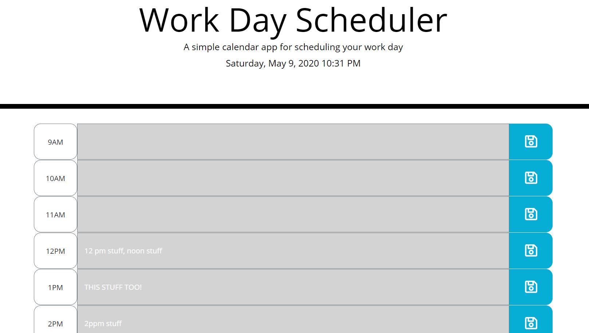

# Work-Day-Scheduler

The Work Day Scheduler has time slots available from 9am to 5pm, and is able to save the contents of each time slot to local storage, allowing the page to be closed and reloaded without losing content.

Each save button on the side of the input boxes saves only the content of that box, allowing for specific changes to be made on each line without overwriting or re-saving the contents of the entire page.  

Additonally, as the hour of the day shifts, the text tiles will change colors to both warn the user of the current hour, and to show them the hours that have already passed.

The Date and Time up at the top of the page update every 15 seconds, which also refreshes the background colors of the page, checking if the hour has passed while the page is being viewed. 
